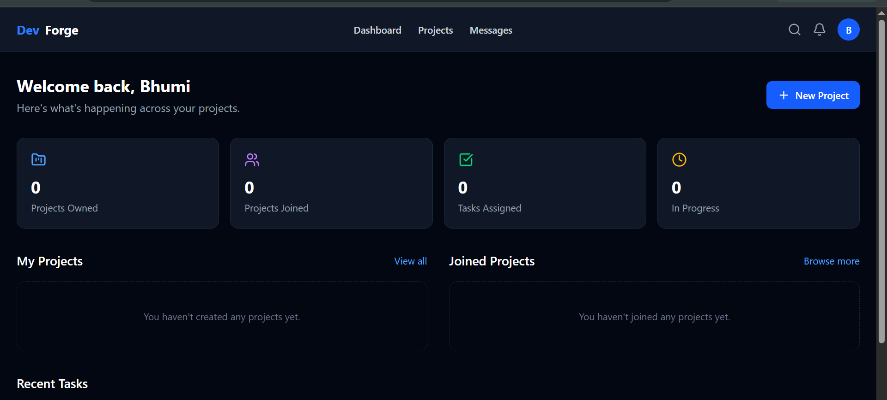
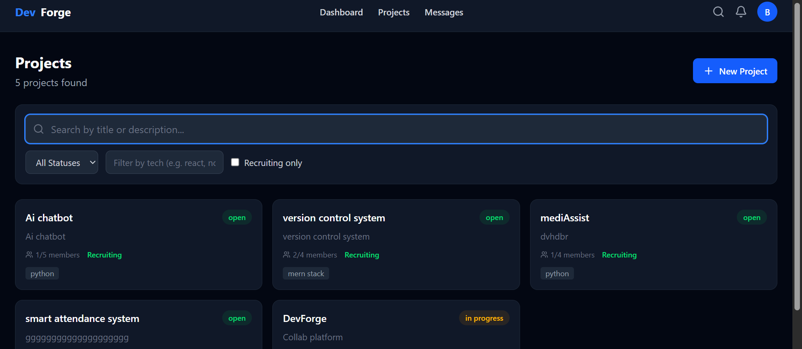
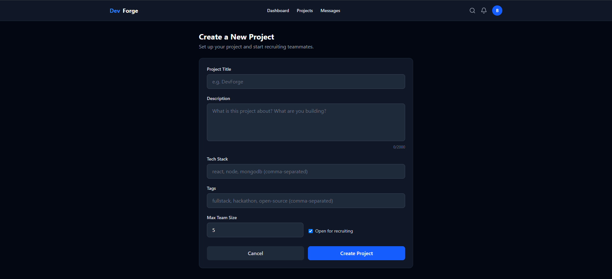
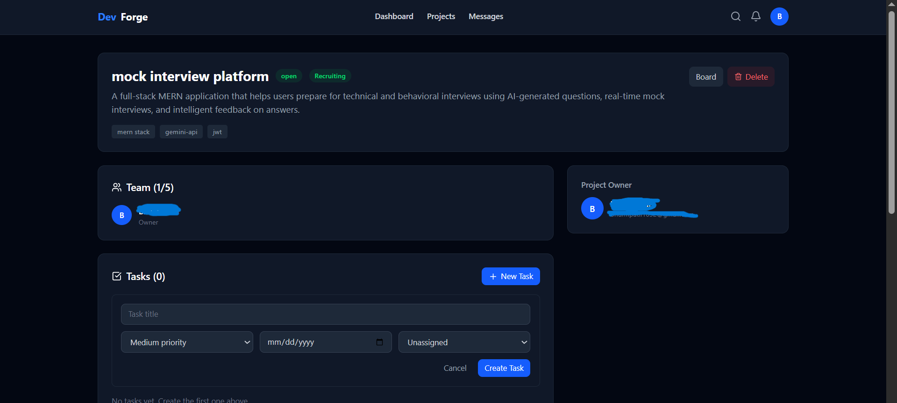
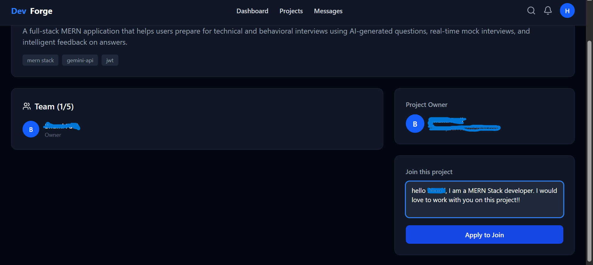
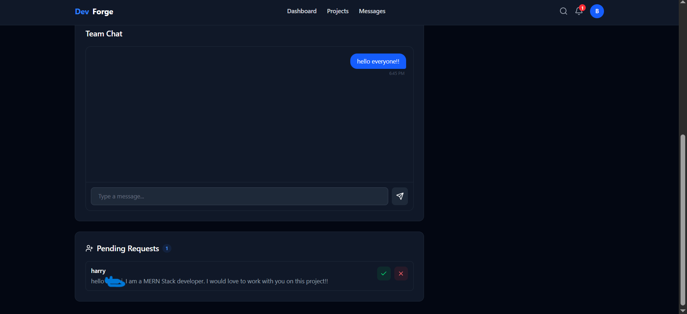
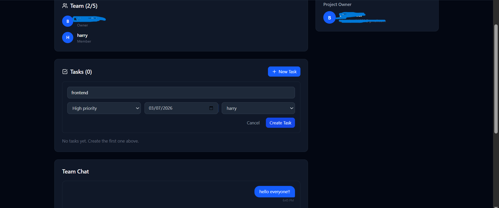

# **DevForge**
It's a platform where developers post what they're working on, find teammates who actually have the skills they need, and then manage the whole project together — tasks, chat, a kanban board — without bouncing between five different apps.

Live: dev-forge-delta.vercel.app
Repo: github.com/Bhumi3-4/DevForge

## **What you can do with it**

-**Find collaborators**
Post a project with a description, tech stack, and tags. Other developers can browse, filter by technology, and apply to join. You review applications and decide who's in.

-**Actually manage the work**
Once a team forms, you get a full task management system — create tasks, set priorities and due dates, assign them to teammates, and drag them across a kanban board (Todo → In Progress → Review → Done) as work progresses.

-**alk to your team**
Every project gets a real-time chat room. There's also 1:1 direct messaging between any two users, with online presence indicators and typing indicators so it feels like a real workspace, not a message board.

-**Stay informed**
In-app notifications for the things that actually matter: someone applied to your project, your application got accepted, a task was assigned to you. No noise, just signal.

## **Tech Stack**
I built this as a full MERN stack app with real-time features on top:
-Frontend: React (Vite) + Tailwind CSS, React Router v6, Axios (with JWT interceptors), Socket.io client, @hello-pangea/dnd for drag-and-drop, Lucide for icons.
-Backend: Node.js + Express, MongoDB + Mongoose, Socket.io server, JWT for auth, bcryptjs for password hashing, Helmet for security headers.
-Deployed on: MongoDB Atlas (database), Render (backend), Vercel (frontend).

## Screenshots

  
  
  

  
  
  

  

## **Setup Instructions**
You'll need Node.js (v18+) and either a local MongoDB instance or a free MongoDB Atlas cluster.

**1. Clone it**
-bash
git clone https://github.com/Bhumi3-4/DevForge.git
cd DevForge

**2. Set up the backend**
-bash
cd server
npm install

-Create a file called .env inside server/:
envNODE_ENV=development
PORT=5000
MONGO_URI=mongodb://localhost:27017/devforge
JWT_SECRET=make_this_something_long_and_random
JWT_EXPIRE=7d
CLIENT_URL=http://localhost:5173

-Then start it:
-bash
npm run dev

-If you see ✅ MongoDB Connected and 🚀 Server running on port 5000, you're good.

**3. Set up the frontend**
-bash
cd ../client
npm install

-Create a file called .env inside client/:
env
VITE_API_URL=http://localhost:5000/api
VITE_SOCKET_URL=http://localhost:5000

-Then start it:
bashnpm run dev

4. Open it
Go to http://localhost:5173, register an account, and the app is yours.

**License**
MIT 
